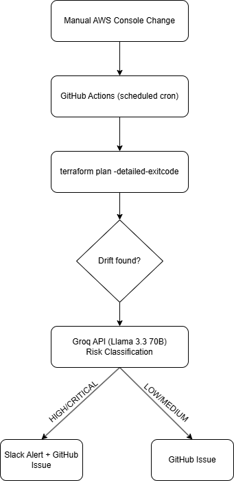

# TerraGuard AI — AI-Enhanced Terraform Drift Detector

[](https://www.terraform.io/)
[](https://registry.terraform.io/providers/hashicorp/aws/latest)
[](https://nodejs.org/)
[](https://www.python.org/)
[](https://github.com/features/actions)
[](./LICENSE)

An event-driven, AI-powered infrastructure drift detector built on AWS. When someone manually changes cloud resources outside of Terraform — opening a port, modifying a security group, changing an instance type — TerraGuard AI catches it, classifies the risk using **Llama 3.3 70B via Groq**, and routes a context-rich alert to Slack and/or creates a GitHub Issue, depending on severity. No noise. No alert fatigue. Just the drift that actually matters, with the exact remediation command to fix it.

The infrastructure being monitored is a real-world, production-pattern stack: a Node.js API running on **ECS Fargate**, a **PostgreSQL** database on **RDS**, and an **Application Load Balancer** — all provisioned as code with Terraform and deployed via GitHub Actions CI/CD.

> 📝 **Design article:** [Read the full write-up on dev.to →](https://dev.to/vatul16)

---

## Table of Contents

- [Architecture](#architecture)
- [Why this project](#why-this-project)
- [How drift detection works](#how-drift-detection-works)
- [Tech stack](#tech-stack)
- [Repository structure](#repository-structure)
- [Prerequisites](#prerequisites)
- [Setup & Deployment Guide](#setup--deployment-guide)
  - [Phase 1 — Bootstrap AWS & Terraform state](#phase-1--bootstrap-aws--terraform-state)
  - [Phase 2 — Provision core infrastructure](#phase-2--provision-core-infrastructure)
  - [Phase 3 — Build & push app image to ECR](#phase-3--build--push-app-image-to-ecr)
  - [Phase 4 — Deploy app to ECS via GitHub Actions](#phase-4--deploy-app-to-ecs-via-github-actions)
  - [Phase 5 — Enable & test drift detection](#phase-5--enable--test-drift-detection)
- [Configuration reference](#configuration-reference)
- [GitHub Secrets reference](#github-secrets-reference)
- [Terraform commands](#terraform-commands)
- [Simulating drift](#simulating-drift)
- [Cost estimate](#cost-estimate)
- [Cleanup](#cleanup)
- [Troubleshooting](#troubleshooting)
- [Roadmap](#roadmap)
- [License](#license)
- [Author](#author)

---

## Architecture



---

## Why this project

Standard Terraform drift detection is a solved problem on paper: run `terraform plan` on a cron job, alert if the exit code is non-zero. The problem is what happens next. In any team with more than a few engineers, someone adds a description to a security group, or tags a resource directly in the console, and the drift detector fires. Engineers get paged. They look at the plan, see it's nothing, and start ignoring alerts. Two weeks later a port 22 rule gets added to a production security group, the alert fires again — and nobody looks.

The root issue is that traditional drift detection treats all drift as equally urgent. It isn't. A changed description and an exposed SSH port are both drift, but they have nothing in common in terms of what you should do next.

TerraGuard AI adds a classification layer between detection and alerting. Terraform handles detection deterministically — it's better at it than any heuristic. The AI layer handles the part Terraform can't do: understanding what a change *means*, whether it should be reverted or adopted, and who needs to know about it and how fast. High-risk drift routes to Slack immediately with a remediation command. Low-risk drift becomes a backlog ticket. The on-call engineer sleeps.

A secondary goal of this project was building something that touches a realistic slice of the Cloud/DevOps toolchain in a single repo: IaC with remote state and locking, containerized workloads on Fargate, CI/CD pipelines for both infrastructure and application code, secrets management, IAM scoping, and LLM API integration. It's a portfolio project, but one built to run on real AWS infrastructure, not mocked out.

---

## How drift detection works

1. **Trigger:** GitHub Actions runs on a 6-hour schedule (configurable). It can also be triggered manually from the Actions tab for ad-hoc audits.

2. **Detection:** The Python script runs `terraform plan -detailed-exitcode` against the live AWS account. Exit code `0` means no drift. Exit code `2` means changes are present — drift detected. Exit code `1` means a plan error.

3. **Parsing:** The plan output is parsed to extract which resources changed and which attributes were modified. Sensitive attribute values are stripped; only attribute *names* are passed forward.

4. **AI analysis:** The sanitized diff is sent to Llama 3.3 70B via the Groq API with a prompt that instructs the model to act as a Senior Cloud Security Engineer. The model returns a structured JSON object containing a risk level (`CRITICAL` / `HIGH` / `MEDIUM` / `LOW` / `INFO`), a risk score out of 10, the impact, a recommended action (`REVERT` / `ADOPT` / `INVESTIGATE` / `MONITOR`), and the exact Terraform or AWS CLI command to remediate.

5. **Routing:**
   - `CRITICAL` or `HIGH` → Slack alert (immediate, with full context) + GitHub Issue for audit trail
   - `MEDIUM`, `LOW`, or `INFO` → GitHub Issue only (goes to the backlog, not the on-call channel)

The AI does not detect drift. Terraform does. The AI decides what the drift means and what to do about it.

---

## Tech stack

| Layer | Technology |
|---|---|
| Infrastructure as Code | Terraform >= 1.15.6, AWS provider ~> 5.0 |
| Compute | AWS ECS Fargate (serverless containers) |
| Application | Node.js 20, Express |
| Database | Amazon RDS for PostgreSQL 15 (db.t3.micro) |
| Load Balancing | AWS Application Load Balancer |
| Container Registry | Amazon ECR |
| AI / LLM | Llama 3.3 70B via Groq API (free tier) |
| Drift Detection | Python 3.11, Terraform CLI |
| CI/CD | GitHub Actions |
| Secrets | AWS Secrets Manager |
| Remote State | S3 (state locking) |
| Access | Bastion Host (EC2 t2.micro, Amazon Linux 2023) |
| Alerting | Slack Incoming Webhooks + GitHub Issues API |

---

## Repository structure

```
terraguard-ai/
├── app/                              # Node.js application
│   ├── src/
│   │   ├── index.js                  # Express entry point
│   │   ├── config/database.js        # PostgreSQL connection (pg)
│   │   ├── models/user.js
│   │   ├── controllers/userController.js
│   │   ├── routes/userRoutes.js
│   │   └── migrations/init.sql       # DB schema
│   ├── Dockerfile
│   ├── package.json
│   ├── .env.example
│   └── .dockerignore
├── infra/                            # Terraform — all AWS infrastructure
│   ├── backend.tf                    # S3 remote state + locking
│   ├── main.tf                       # Provider, VPC, subnets, routing, NAT
│   ├── ecr.tf                        # ECR repository + lifecycle policy
│   ├── ecs.tf                        # ECS cluster, task definition, service
│   ├── alb.tf                        # Application Load Balancer, target group, listener
│   ├── rds.tf                        # RDS PostgreSQL + subnet group
│   ├── bastion.tf                    # Bastion EC2 instance + security group
│   ├── iam.tf                        # ECS roles, Secrets Manager policy, OIDC
│   ├── secrets.tf                    # AWS Secrets Manager for DB password
│   ├── variables.tf
│   ├── outputs.tf
│   └── terraform.tfvars.example
├── detector/                         # AI drift detection engine
│   ├── detect_drift.py               # Main script: plan → parse → AI → alert
│   └── requirements.txt
├── .github/
│   └── workflows/
│       ├── deploy-app.yml            # Triggered on app/** push: build → ECR → ECS
│       └── drift-detector.yml        # Scheduled: terraform plan → Groq → Slack/GH
├── assets/
│   └── architecture.png             # Architecture diagram
└── README.md
```

---

## Prerequisites

- [Terraform](https://developer.hashicorp.com/terraform/downloads) >= 1.15.6
- [AWS CLI v2](https://docs.aws.amazon.com/cli/latest/userguide/getting-started-install.html), configured with credentials (`aws configure`)
- An AWS account with permissions to create VPC, ECS, ECR, RDS, ALB, IAM, Secrets Manager, and S3 resources
- [Docker](https://docs.docker.com/get-docker/) for building the application image
- [Python 3.11+](https://www.python.org/downloads/) for running the drift detector locally
- A [Groq account](https://console.groq.com) (free — no credit card required) for the AI analysis
- A Slack workspace with an Incoming Webhook configured
- An EC2 Key Pair in your target region (for the Bastion Host)
- [jq](https://jqlang.github.io/jq/download/) installed (used by the deploy workflow to manipulate task definitions)

---

## Setup & Deployment Guide

This project deploys in five sequential phases. Each phase has a clear dependency on the previous one.

### Phase 1 — Bootstrap AWS & Terraform state

Before Terraform can run, the S3 bucket it uses for remote state need to exist. These are created manually — once, with the AWS CLI.

```bash
# Replace 123456789012 with your actual AWS account ID
ACCOUNT_ID=$(aws sts get-caller-identity --query Account --output text)
REGION="ap-south-1"   # Change to your region
BUCKET_NAME="terraguard-tfstate-${ACCOUNT_ID}"

# Create the state bucket
aws s3api create-bucket \
  --bucket "${BUCKET_NAME}" \
  --region "${REGION}" \
  --create-bucket-configuration LocationConstraint="${REGION}"

# Enable versioning (protects against accidental state corruption)
aws s3api put-bucket-versioning \
  --bucket "${BUCKET_NAME}" \
  --versioning-configuration Status=Enabled

# Enable server-side encryption
aws s3api put-bucket-encryption \
  --bucket "${BUCKET_NAME}" \
  --server-side-encryption-configuration \
    '{"Rules":[{"ApplyServerSideEncryptionByDefault":{"SSEAlgorithm":"AES256"}}]}'

echo "State bucket: ${BUCKET_NAME}"
```

Update `infra/backend.tf` with the bucket name printed above, then create your EC2 Key Pair for bastion SSH access:

```bash
aws ec2 create-key-pair \
  --key-name terraguard-bastion \
  --region "${REGION}" \
  --query 'KeyMaterial' \
  --output text > ~/.ssh/terraguard-bastion.pem

chmod 400 ~/.ssh/terraguard-bastion.pem
```

---

### Phase 2 — Provision core infrastructure

This single `terraform apply` creates everything: VPC, subnets, NAT Gateway, ALB, ECR repository, ECS cluster, RDS PostgreSQL, Bastion Host, IAM roles, and Secrets Manager entry for the DB password. RDS takes 10–15 minutes.

```bash
cd infra/

# Copy the example vars file and fill in your values
cp terraform.tfvars.example terraform.tfvars

# Edit terraform.tfvars:
#   db_password      = "YourSecurePassword123!"
#   bastion_key_name = "terraguard-bastion"
#   github_org       = "your-github-username"
#   github_repo      = "terraguard-ai"

# Initialize Terraform (downloads providers, configures S3 backend)
terraform init

# Preview every resource that will be created (~35 resources)
terraform plan

# Deploy (confirm with 'yes' when prompted)
terraform apply
```

Once complete, save the outputs — you'll need them for GitHub Secrets in Phase 4:

```bash
terraform output ecr_repository_url    # → ECR_REPOSITORY_NAME (the name after the last /)
terraform output ecs_cluster_name      # → ECS_CLUSTER_NAME
terraform output ecs_service_name      # → ECS_SERVICE_NAME
terraform output alb_dns_name          # → your app's public URL
terraform output bastion_public_ip     # → SSH jump host IP
```

At this point, the ECS service is running a placeholder `nginx:alpine` image. That's expected — the real app gets deployed in Phase 4.

---

### Phase 3 — Build & push app image to ECR

This step is normally handled automatically by GitHub Actions on every push to `app/**`. Run it manually once to bootstrap the first real deployment.

```bash
# Authenticate Docker to ECR
ACCOUNT_ID=$(aws sts get-caller-identity --query Account --output text)
REGION="ap-south-1"
ECR_REGISTRY="${ACCOUNT_ID}.dkr.ecr.${REGION}.amazonaws.com"
ECR_REPO="terraguard-app"

aws ecr get-login-password --region "${REGION}" \
  | docker login --username AWS --password-stdin "${ECR_REGISTRY}"

# Build the image
docker build \
  --file app/Dockerfile \
  --tag "${ECR_REGISTRY}/${ECR_REPO}:latest" \
  --tag "${ECR_REGISTRY}/${ECR_REPO}:sha-manual-bootstrap" \
  app/

# Push to ECR
docker push "${ECR_REGISTRY}/${ECR_REPO}:latest"
docker push "${ECR_REGISTRY}/${ECR_REPO}:sha-manual-bootstrap"

echo "Image pushed: ${ECR_REGISTRY}/${ECR_REPO}:latest"
```

---

### Phase 4 — Deploy app to ECS via GitHub Actions

**Add the following secrets** to your GitHub repository (Settings → Secrets and variables → Actions):

| Secret | Value |
|---|---|
| `AWS_ACCESS_KEY_ID` | Your IAM user access key |
| `AWS_SECRET_ACCESS_KEY` | Your IAM user secret key |
| `AWS_REGION` | `ap-south-1` (or your region) |
| `ECR_REPOSITORY_NAME` | `terraguard-app` |
| `ECS_CLUSTER_NAME` | `terraguard-cluster` |
| `ECS_SERVICE_NAME` | `terraguard-service` |
| `CONTAINER_NAME` | `terraguard-app` |
| `DB_PASSWORD` | Same password you set in `terraform.tfvars` |

Once secrets are set, trigger the deploy workflow:

```bash
# Option A: push any change to app/** to trigger the workflow automatically
touch app/src/index.js && git add . && git commit -m "trigger: initial ECR deploy" && git push

# Option B: trigger manually from the GitHub Actions tab
# Go to: Actions → Deploy App to ECS → Run workflow
```

The workflow will: build the Docker image → tag it with the git SHA → push to ECR → update the ECS task definition → update the ECS service → wait for `services-stable`.

Verify the deployment completed successfully:

```bash
# Check ECS service health
aws ecs describe-services \
  --cluster terraguard-cluster \
  --services terraguard-service \
  --query 'services[0].{Status:status,Running:runningCount,Desired:desiredCount}' \
  --output table

# Hit the app via ALB
ALB_DNS=$(cd infra && terraform output -raw alb_dns_name)
curl http://${ALB_DNS}/api/health
# Expected: {"status":"ok"}
```

---

### Phase 5 — Enable & test drift detection

**Add the remaining secrets** for the drift detector:

| Secret | Value |
|---|---|
| `TF_STATE_BUCKET` | Your S3 bucket name from Phase 1 |
| `GROQ_API_KEY` | From [console.groq.com](https://console.groq.com) (free) |
| `SLACK_WEBHOOK_URL` | From your Slack app's Incoming Webhooks settings |

The drift detection workflow (`drift-detector.yml`) runs automatically every 6 hours. Trigger it manually to verify everything is working:

```bash
# Go to: Actions → TerraGuard AI — Drift Detector → Run workflow
# Check the workflow summary for:
# ✅ No drift detected  (if infra matches Terraform state)
# ⚠️ DRIFT DETECTED     (if something changed outside Terraform)
```

To run the detector locally for development:

```bash
cd detector/
pip install -r requirements.txt

export GROQ_API_KEY="gsk_xxxxxxxxxxxx"
export SLACK_WEBHOOK_URL="https://hooks.slack.com/services/..."
export GITHUB_TOKEN="ghp_xxxxxxxxxxxx"
export GITHUB_REPOSITORY="your-username/terraguard-ai"
export TF_VAR_db_password="YourSecurePassword123!"

python detect_drift.py
```

---

## Configuration reference

All variables live in `infra/variables.tf`. Required values must be set in `terraform.tfvars` (never committed — it's in `.gitignore`).

| Variable | Required | Default | Description |
|---|---|---|---|
| `aws_region` | No | `us-east-1` | AWS region for all resources |
| `project_name` | No | `terraguard` | Prefix applied to all resource names |
| `environment` | No | `dev` | Environment tag (`dev` / `staging` / `prod`) |
| `db_password` | **Yes** | — | RDS master password (stored in Secrets Manager) |
| `bastion_key_name` | **Yes** | — | EC2 Key Pair name for SSH access to Bastion |
| `github_org` | **Yes** | — | Your GitHub username or org (for IAM OIDC trust policy) |
| `github_repo` | **Yes** | — | Your GitHub repository name |
| `app_image` | No | `""` | ECR image URI. Empty on first deploy; CI/CD sets this. |
| `app_port` | No | `3000` | Container port (matches `EXPOSE` in Dockerfile) |

---

## GitHub Secrets reference

| Secret | Used by | Required |
|---|---|---|
| `AWS_ACCESS_KEY_ID` | Both workflows | ✅ |
| `AWS_SECRET_ACCESS_KEY` | Both workflows | ✅ |
| `AWS_REGION` | Both workflows | ✅ |
| `DB_PASSWORD` | `deploy-infra.yml` | ✅ |
| `ECR_REPOSITORY_NAME` | `deploy-app.yml` | ✅ |
| `ECS_CLUSTER_NAME` | `deploy-app.yml` | ✅ |
| `ECS_SERVICE_NAME` | `deploy-app.yml` | ✅ |
| `CONTAINER_NAME` | `deploy-app.yml` | ✅ |
| `TF_STATE_BUCKET` | `drift-detector.yml` | ✅ |
| `GROQ_API_KEY` | `drift-detector.yml` | ✅ |
| `SLACK_WEBHOOK_URL` | `drift-detector.yml` | ✅ |

---

## Terraform commands

Run all commands from the `infra/` directory.

| Command | Purpose |
|---|---|
| `terraform init` | Download providers, configure S3 backend |
| `terraform validate` | Check syntax and internal consistency |
| `terraform fmt -recursive` | Auto-format all `.tf` files |
| `terraform plan` | Preview what will change |
| `terraform plan -out=tfplan` | Save plan to apply later |
| `terraform apply` | Create or update infrastructure |
| `terraform apply tfplan` | Apply a saved plan |
| `terraform output` | Print all outputs |
| `terraform output -raw alb_dns_name` | Print just the ALB URL |
| `terraform state list` | List all tracked resources |
| `terraform refresh` | Sync state with real AWS resources |
| `terraform destroy` | Tear down all managed resources |

---

## Simulating drift

Use these scenarios to test the detector end-to-end. Always revert manual changes after testing.

**Scenario 1: Benign drift (expected result: GitHub Issue, INFO/LOW risk)**

```
AWS Console → EC2 → Security Groups → terraguard-alb-sg
Add a tag: Key=Owner, Value=manual-test
```

**Scenario 2: Critical security drift (expected result: Slack alert, CRITICAL risk)**

```
AWS Console → EC2 → Security Groups → terraguard-ecs-sg
Add inbound rule: Type=SSH, Port=22, Source=0.0.0.0/0
```
> ⚠️ Remove this rule immediately after the test. Never leave port 22 open to `0.0.0.0/0`.

**Scenario 3: Trigger drift detection manually**

```bash
# From the GitHub Actions tab:
Actions → TerraGuard AI — Drift Detector → Run workflow
```

**Expected Slack alert format (CRITICAL):**

```
🚨 TerraGuard AI — CRITICAL Drift Detected
Risk Score: 9/10  |  Category: Security  |  Action Required: REVERT
AI Analysis: Security group ingress rule added exposing SSH to the internet.
Impact: Any host on the internet can attempt SSH brute-force against ECS tasks.
Remediation: terraform apply -target=aws_security_group.ecs_tasks
```

---

## Accessing the database via Bastion

The RDS instance is in an isolated private subnet with no internet route. Use the Bastion Host as an SSH tunnel to connect.

```bash
# SSH into the Bastion
BASTION_IP=$(cd infra && terraform output -raw bastion_public_ip)
ssh -i ~/.ssh/terraguard-bastion.pem ec2-user@${BASTION_IP}

# From inside the Bastion, connect to RDS
RDS_HOST=$(cd infra && terraform output -raw rds_endpoint)
psql -h ${RDS_HOST} -U terraguard_admin -d terraguard
# Password: your db_password from terraform.tfvars
```

---

## Cost estimate

Sized for a personal dev/portfolio environment. Costs are approximate for `ap-south-1`.

| Resource | Approx. monthly cost |
|---|---|
| ECS Fargate (0.25 vCPU, 512 MB, 1 task) | ~$3–5 |
| RDS db.t3.micro (single-AZ, 20 GB gp2) | ~$15–20 |
| Application Load Balancer | ~$16–18 |
| NAT Gateway | ~$30–35 |
| Bastion EC2 t2.micro | ~$8–10 |
| S3 + DynamoDB (Terraform state) | <$1 |
| Secrets Manager | ~$0.40 |
| ECR (10 images) | <$1 |
| Groq API | **Free** |
| GitHub Actions | **Free** |
| **Total** | **~$74–90/month** |

**To reduce costs while not actively using the project:**

```bash
# Stop the ECS service (0 running tasks = $0 Fargate cost)
aws ecs update-service \
  --cluster terraguard-cluster \
  --service terraguard-service \
  --desired-count 0

# Stop the RDS instance
aws rds stop-db-instance --db-instance-identifier terraguard-postgres

# Restart when needed
aws ecs update-service --cluster terraguard-cluster --service terraguard-service --desired-count 1
aws rds start-db-instance --db-instance-identifier terraguard-postgres
```

The biggest fixed cost is the NAT Gateway (~$30/month). If cost is the primary concern, replace it with a VPC Endpoint for ECR/Secrets Manager access and a public subnet for ECS tasks — though this trades off the network isolation that makes the security story interesting.

---

## Cleanup

```bash
cd infra/
terraform destroy
```

Confirm with `yes`. This removes every resource Terraform created, including RDS (no final snapshot is taken in dev — set `skip_final_snapshot = false` before destroying anything with real data). The Secrets Manager secret is deleted immediately (`recovery_window_in_days = 0`).

The S3 state bucket and DynamoDB lock table were created manually in Phase 1, so they are not managed by Terraform and must be deleted separately if needed:

```bash
aws s3 rb s3://terraguard-tfstate-ACCOUNT_ID --force
aws dynamodb delete-table --table-name terraguard-tf-locks
```

---

## Troubleshooting

| Symptom | Likely cause | Fix |
|---|---|---|
| `terraform apply` fails: `ResourceInUse` on target group | Port change forces TG replacement; listener held the reference | Run `terraform apply` again — it resolves on the second pass |
| ECS tasks in `PROVISIONING` but not `RUNNING` | Image pull failed (ECR auth) or Secrets Manager permission missing | Check CloudWatch logs: `/ecs/terraguard`. Verify `ecs_secrets` IAM policy is attached |
| ALB targets `unhealthy` | App not listening on port 3000, or `/api/health` returning non-200 | Run `aws ecs execute-command` or check CW logs for Node.js startup errors |
| `detect_drift.py` errors: `terraform init` failed | Backend bucket name mismatch, or AWS credentials not set in env | Confirm `TF_STATE_BUCKET` secret matches the bucket created in Phase 1 |
| Groq API returns non-JSON response | Model occasionally adds markdown fences to JSON | The script strips fences automatically; if it still fails, check `GROQ_API_KEY` is valid |
| Bastion SSH: `Permission denied` | Wrong key or wrong username | Use `ec2-user` for Amazon Linux 2023, not `ubuntu` or `admin` |
| RDS connection refused from Bastion | Bastion SG not in RDS ingress rules | Verify `infra/rds.tf` includes `aws_security_group.bastion.id` in the ingress block |
| `terraform destroy` hangs on VPC | NAT Gateway or ENI not fully released | Wait 2–3 minutes and retry; check the AWS console for orphaned ENIs in the VPC |

---

## Roadmap

- [ ] **EventBridge + CloudTrail integration** — detect drift within seconds of a console change, instead of waiting for the next cron window
- [ ] **Auto-remediation with approval gate** — for CRITICAL drift, open a GitHub PR with the fix and require one approval before applying
- [ ] **HTTPS on the ALB** — ACM certificate + HTTPS listener with HTTP→HTTPS redirect
- [ ] **Switch from access keys to OIDC** — replace `AWS_ACCESS_KEY_ID`/`SECRET` in GitHub Secrets with a keyless IAM role assumed via OIDC (already scaffolded in `iam.tf`)
- [ ] **Drift history dashboard** — store detection results in DynamoDB and visualize trends over time
- [ ] **Multi-environment support** — separate `dev`/`staging`/`prod` Terraform workspaces with environment-specific alerting thresholds
- [ ] **Slack interactive buttons** — "Revert now" and "Mark as known" directly from the Slack alert

---

## License

This project is licensed under the [MIT License](./LICENSE).

---

## Author

**Atul Vishwakarma** — Cloud/DevOps Engineer

[LinkedIn](https://linkedin.com/in/vatul16) · [GitHub](https://github.com/vatul16) · [dev.to](https://dev.to/vatul16)

If you're interested in the design decisions behind this architecture — why ECS Fargate over EC2 ASGs, how Groq was chosen, and what alert fatigue actually looks like at scale — the full write-up is on dev.to.